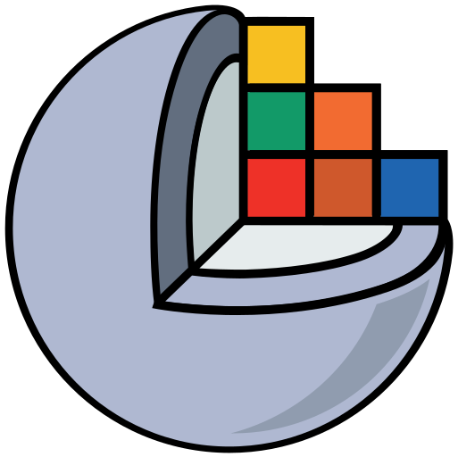

# Slicer4Minute Tutorial

This tutorial is a 4-minute introduction to Slicer.

Authors: Sonia Pujol, Ph.D., Andras Lasso

---

## 3D Visualization

The Models module GUI display the list of models loaded in the slicer4minute scene., Their color and the value of their opacity (between 0.0 an 1.0)

---

## Instrucctión for QToolButton

---

## Instrucctión for QToolButton

---

## Instrucctión for QSlider

